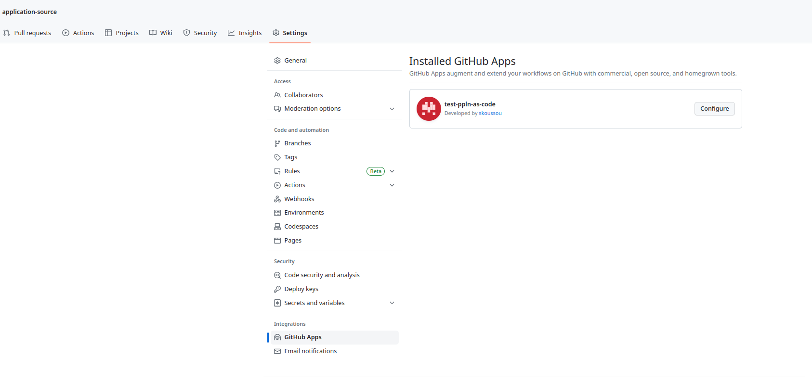
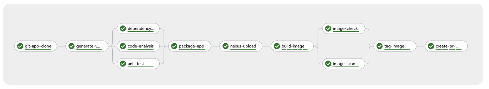
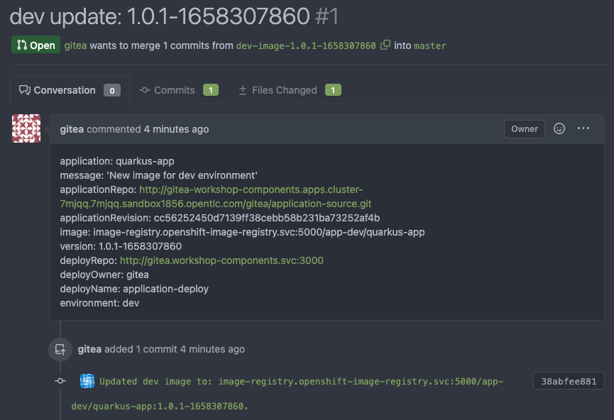
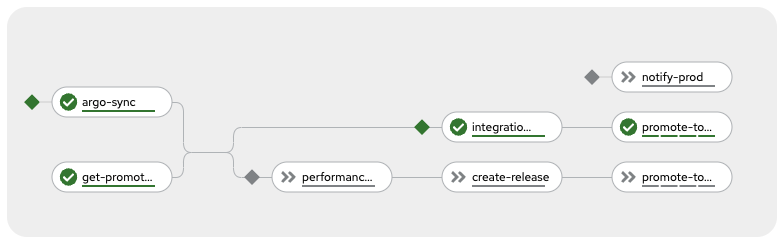
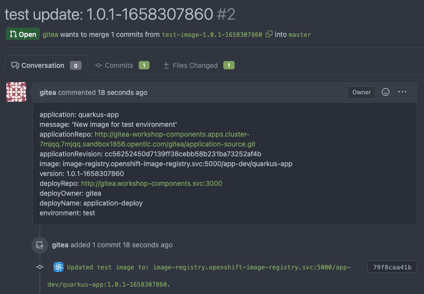
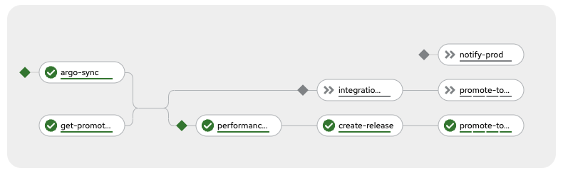
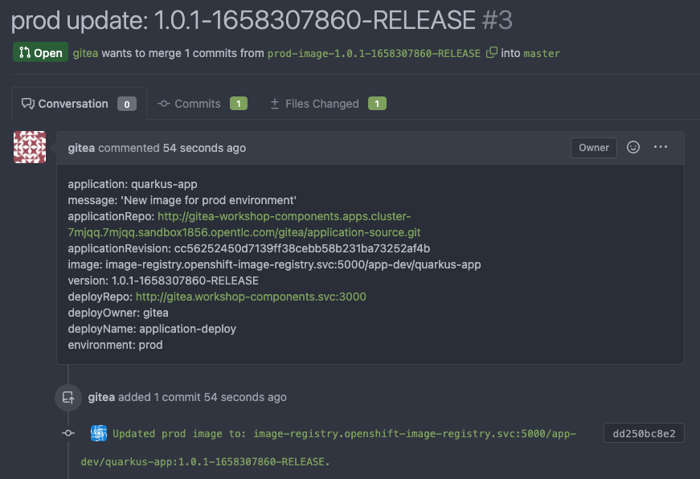
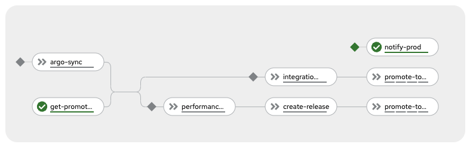
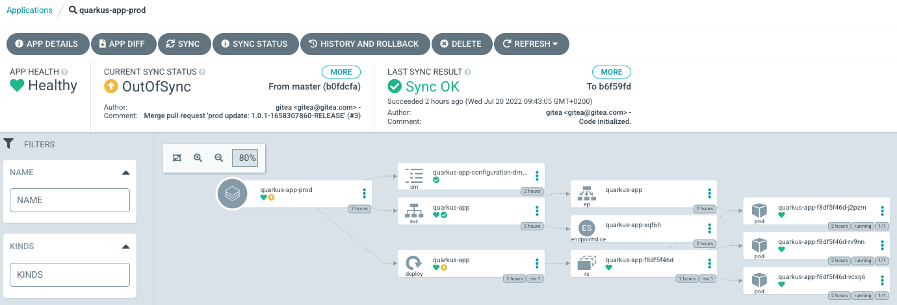
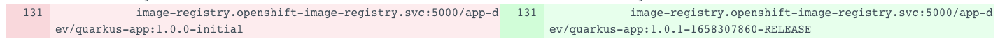

# tekton-workshop

Tekton pipelines workshop

>IMPORTANT: This branch utilizes [`pipeline-as-code`](https://docs.openshift.com/container-platform/4.13/cicd/pipelines/using-pipelines-as-code.html) 
> functionality to build the application and an image for it from sourecode directory [`application-source`](application-source)). 
> For that purpose we have added in [application-source/.tekton](application-source/.tekton) the [pipelinerun.yaml](application-source/.tekton/pipelinerun.yaml) 
> but as the original [main branch](https://github.com/skoussou/tekton-gitops-workshop/tree/main) of this repository uses gitea to make the `application-source` 
> available to the pipelines, a supported pipeline-as-code GIT Provider, therefore you will need to make it available on Github as it is a supported 
> [Pipeline as Code GIT Repository hosting provider](https://docs.openshift.com/container-platform/4.13/cicd/pipelines/using-pipelines-as-code.html#using-pipelines-as-code-with-a-git-repository-hosting-service-provider) 
> in order to connect the `application-source` via Github.

How to:
* Fork [application-source](https://github.com/skoussou/application-source) into your Github user/org
* Follow the normal *Installation* via the `install.sh` script below along with a new section for [Pipeline-as-code Setup](README.md#pipeline-as-code-setup)

## Prerequisites

- oc client.
- openshift cluster with admin rights.

## Installation

Open a terminal abd login into OpenShift using and user with admin rights.

1. Configure in `install.sh`
   * `CSV_GITOPS`: csv version for OCP GitOps operator
   * `CSV_PIPELINES`: csv version for OCP Pipelines operator

2. Execute `install.sh` script. The final output contains the demo installation information. Example:

```
+++++++++++++++++++++++++++++++++++++++++++++++++++++++++++++

INSTALATION COMPLETED!!

OPENSHIFT NAMESPACES:
  - components: ${YOUR_NAME_INITIAL}-workshop-components
  - dev: ${YOUR_NAME_INITIAL}-app-dev
  - test: ${YOUR_NAME_INITIAL}-app-test
  - production: ${YOUR_NAME_INITIAL}-app-prod

GITEA:
  - url: http://gitea-${YOUR_NAME_INITIAL}-workshop-components.apps.cluster-7mjqq.7mjqq.sandbox1856.opentlc.com
  - user: gitea
  - password: openshift

ARGO:
  - url: https://openshift-gitops-server-openshift-gitops.apps.cluster-7mjqq.7mjqq.sandbox1856.opentlc.com
  - user: admin
  - password: iDcS0auoFe5ZE4G3NMpbQvRX7CJgxYPw

PIPELINES:
  - push webhook: N/A due to pipeline-as-code functionality
  - pull request webhook: http://el-quarkus-app-pr-listener.${YOUR_NAME_INITIAL}-workshop-components.svc.cluster.local:8080

+++++++++++++++++++++++++++++++++++++++++++++++++++++++++++++
```

Configure gitea webhooks for application push events in master branch (using installation information values):

- N/A due to [*_pipeline-as-code_*](https://docs.openshift.com/container-platform/4.13/cicd/pipelines/using-pipelines-as-code.html) functionality use

Configure gitea webhooks for deploy pull request events (using installation information values):

- Open **GITEA url** and login.
- Open `application-deploy`
- Create a webhook in `Settings > Webhooks > Add Webhook`
- Target URL must be **PIPELINES pull request**
- HTTP Method must be `POST`
- POST Content Type must be `application/json`
- Secret can be any value
- Trigger On `Custon Events` and mark `Pull Request`

Login into ArgoCD and manually sync applications.

### Pipeline-as-code Setup

* [Create and configure a Github App](https://docs.openshift.com/container-platform/4.13/cicd/pipelines/using-pipelines-as-code.html#configuring-github-app-for-pac) for your OCP server's `pipeline-as-code` usage (use a unique Github App name)
    * **Note:** This will take place in the forked repository above
      ```BASH
      $ oc project openshift-pipelines
      $ tkn pac bootstrap
          => Checking if Pipelines as Code is installed.
          ✓ Pipelines as Code is already installed.
          ? Enter the name of your GitHub application:  test-ppln-as-code
          👀 I have detected an OpenShift Route on: https://pipelines-as-code-controller-openshift-pipelines.apps.cluster-q6vlz.q6vlz.sandbox1387.opentlc.com
          ? Do you want me to use it? Yes
          🌍 Starting a web browser on http://localhost:8080, click on the button to create your GitHub APP
          🔑 Secret pipelines-as-code-secret has been created in the openshift-pipelines namespace
          🚀 You can now add your newly created application on your repository by going to this URL:
          
          https://github.com/apps/test-ppln-as-code
          
          💡 Don't forget to run the "tkn pac create repo" to create a new Repository CRD on your cluster.
      ```
    * Add the Github App to the forked repository (Your settings -> Developer Settings -> Edit (`test-pipeline-as-code`) -> Install (to your user/org) -> Select your forked `application-source` repo)
      

* [Add the webhook](https://docs.openshift.com/container-platform/4.13/cicd/pipelines/using-pipelines-as-code.html#using-pipelines-as-code-with-github-webhook_using-pipelines-as-code) for the pipeline as code

    ```BASH
    $ tkn pac create repository
      ? Enter the Git repository url (default: https://github.com/skoussou/tekton-gitops-workshop):  https://github.com/skoussou/application-source
      ? Please enter the namespace where the pipeline should run (default: openshift-pipelines): sk-workshop-components
      ✓ Repository skoussou-application-source has been created in sk-workshop-components namespace
      ℹ Directory .tekton has been created.
      ✓ A basic template has been created in .tekton/pipelinerun.yaml, feel free to customize it.
      ℹ You can test your pipeline by pushing generated template to your git repository
    ```

* Last notes
  * the [pipelinerun.yaml](application-source/.tekton/pipelinerun.yaml) dictates that `pipeline-as-code` will only run 
    * after a change on pom.xml has occurred and pushed
    * on branch `main` 

## CICD Demo

> NOTE: Some of the following pipeline tasks are a mock and will be completed later on.

Validate applications are working as expected:

```sh
# dev
DEV_URL=$(oc get route quarkus-app -n ${YOUR_NAME_INITIAL}-app-dev -o jsonpath='{.status.ingress[0].host}')
curl http://$DEV_URL/app/info

# test
TEST_URL=$(oc get route quarkus-app -n ${YOUR_NAME_INITIAL}-app-test -o jsonpath='{.status.ingress[0].host}')
curl http://$TEST_URL/app/info

# prod
PROD_URL=$(oc get route quarkus-app -n ${YOUR_NAME_INITIAL}-app-prod -o jsonpath='{.status.ingress[0].host}')
curl http://$PROD_URL/app/info
```

Open `application-source` repository (**NOTE: Your forked github `application-source` repo**) and modify the application `pom.xml` version:

```xml
<version>1.0.1</version>
```

Commit changes. That push event must trigger tekton `ci-pipeline`:



The result of the `ci-pipeline` is a new image tagged with current version and a pull request in `application-deploy` repository to deploy in **dev** environment:



Merge pull request. That event must trigger tekton `cd-pipeline`:



Validate new version has been deployed:
```sh
curl http://$DEV_URL/app/info

"dev" - quarkus-app:1.0.1
```

The `cd-pipeline` also has created a pull request in `application-deploy` repository to deploy in **test** environment:



Merge pull request. That event must trigger tekton `cd-pipeline`:



Validate new version has been deployed:
```sh
curl http://$TEST_URL/app/info

"test" - quarkus-app:1.0.1
```

The `cd-pipeline` also has created a new tag with `-release` appended and a pull request in `application-deploy` repository to deploy in **prod** environment:



Merge pull request. That event must trigger tekton `cd-pipeline`:



Open ArgoCD and review **prod** application (refresh if needed):




The difference is the new image:



Sync manually the application and validate:

```sh
curl http://$PROD_URL/app/info

"prod" - quarkus-app:1.0.1
```

## Re-Installation

```sh
# Delete argo applications
oc delete application.argoproj.io/quarkus-app -n openshift-gitops

# Delete namespaces
oc delete project ${YOUR_NAME_INITIAL}-workshop-components
oc delete project ${YOUR_NAME_INITIAL}-app-dev
oc delete project ${YOUR_NAME_INITIAL}-app-test
oc delete project ${YOUR_NAME_INITIAL}-app-prod
```

> NOTE: wait until all namespaces are removed sucessfully an proceed with installation.

## Tekton Overview

> NOTE: tkn client required!

Create a namespace:

```sh
oc new-project tekton-overview
```

Create the following task:

```yaml
cat << EOF | oc apply -f  -
apiVersion: tekton.dev/v1beta1
kind: Task
metadata:
  name: demo-task
spec:
  params:
    - name: MESSAGE
  results:
    - name: MESSAGE_DATE
  steps:
    - name: print-message
      image: registry.access.redhat.com/ubi8/ubi-minimal:8.3
      script: |
        echo $(params.MESSAGE)
    - name: get-date
      image: registry.access.redhat.com/ubi8/ubi-minimal:8.3
      script: |
        DATE=$(date)
        echo $DATE > $(results.MESSAGE_DATE.path)
        echo $DATE
EOF
```

Create and test the task:

```sh
tkn task list
tkn task start demo-task
tkn taskrun logs demo-task-run-j662m -f -n tekton-overview
oc get pods
oc logs demo-task-run-xxxxx-pod
oc logs demo-task-run-xxxxx-pod -c step-print-message
oc logs demo-task-run-xxxxx-pod -c step-maven-version
```

Create a pipeline:

```yaml
cat << EOF | oc apply -f  -
apiVersion: tekton.dev/v1beta1
kind: Pipeline
metadata:
  name: demo-pipeline
spec:
  params:
    - name: MESSAGE
  tasks:
    - name: task-1
      taskRef:
        kind: Task
        name: demo-task
      params:
        - name: MESSAGE
          value: $(params.MESSAGE)
    - name: task-2
      runAfter:
        - task-1
      taskRef:
        kind: Task
        name: demo-task
      params:
        - name: MESSAGE
          value: "$(tasks.task-1.results.MESSAGE_DATE)"
EOF
```

Create and test the pipeline:

```sh
tkn pipeline list
tkn pipeline start demo-pipeline
tkn pipelinerun logs demo-pipeline-run-xxxxx -f -n tekton-overview
tkn pipeline list
oc get pods
```
